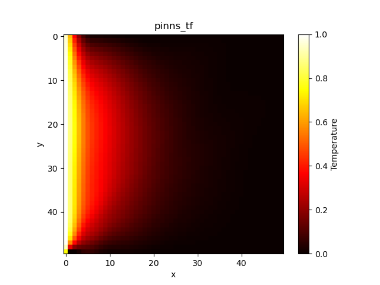
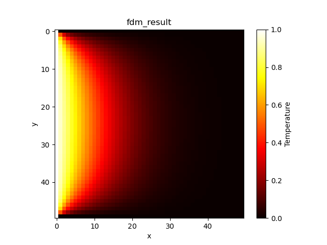

## intro-control-ml

This repository contains implementations based on the "Introduction to Control Systems and Machine Learning" lecture. It includes projects and code that apply concepts such as system dynamics, feedback control, and machine learning techniques to real-world problems.

## Requirements

To run this project, you need the following dependencies:

- Python 3.10
- Required Python packages (listed in `requirements.txt`):


## Installation

1. Fork the project

2. Clone the repository:
   ```bash
   git clone https://github.com/your_repository_name/intro-control-ml.git
   
3. go to the working directory
   ```bash
   cd intro-control-ml

4. create a virtual python enviroment
   ```bash
   python -m venv cml

5. active the virtual enviroment
   ```bash
   source cml/bin/active

6. You can install the required packages using:
    ```bash
    pip install -r requirements.txt

## Loss and Notation

### Notation
- $\mathbf{x}_b, \mathbf{y}_b, \mathbf{t}_b$: Boundary points (spatial and temporal). 
- $u_b $: True boundary values at these points.
- $\mathbf{x}_i, \mathbf{y}_i, \mathbf{t}_i$: Interior points of the domain (spatial and temporal).
- $u(\mathbf{x}, \mathbf{y}, t)$: Neural network's predicted scalar output (e.g., temperature).
- $\frac{\partial u}{\partial t}$: First-order time derivative of $ u$.
- $\frac{\partial u}{\partial x}, \frac{\partial u}{\partial y}$: First-order spatial derivatives of $ u$.
- $\frac{\partial^2 u}{\partial x^2}, \frac{\partial^2 u}{\partial y^2}$: Second-order spatial derivatives of $u$.
- $\alpha$: Thermal diffusivity constant (or similar parameter).
- $N_b$: Number of boundary points.
- $N_i$: Number of interior points.

### Loss Function
$$
\text{Total Loss} = 
\frac{1}{N_b} \sum_{j=1}^{N_b} \left( u(\mathbf{x}_b^j, \mathbf{y}_b^j, t_b^j) - u_b^j \right)^2 + 
\frac{1}{N_i} \sum_{i=1}^{N_i} \left( \frac{\partial u}{\partial t_i} - \alpha \left( \frac{\partial^2 u}{\partial x_i^2} + \frac{\partial^2 u}{\partial y_i^2} \right) \right)^2
$$


## Tested results



